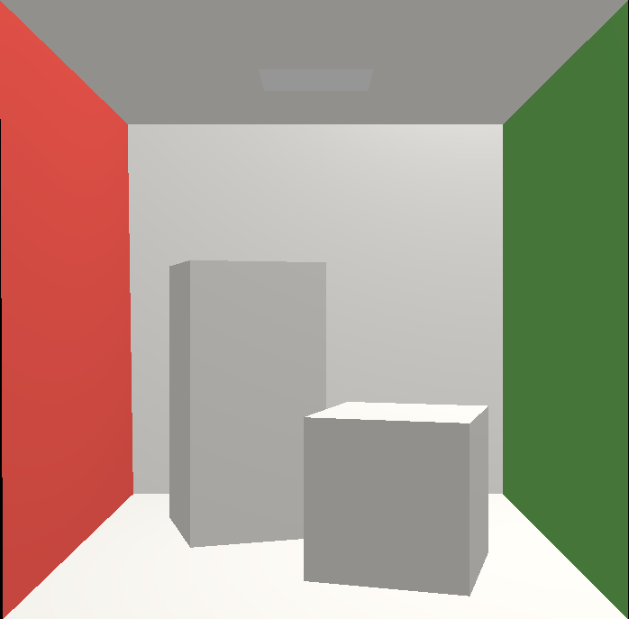
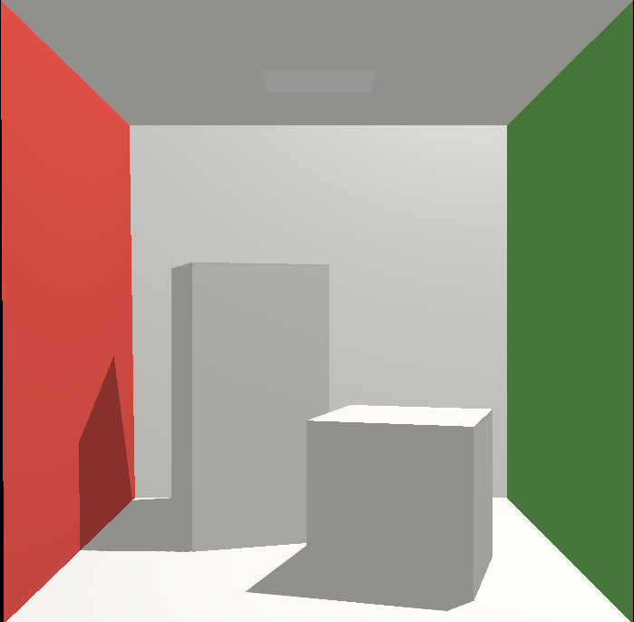
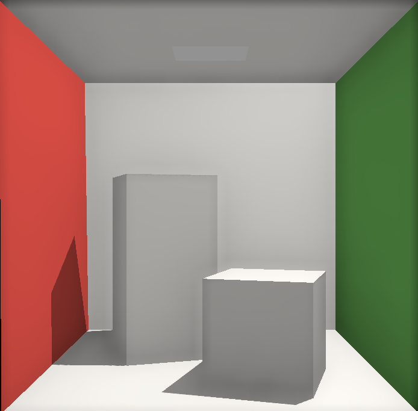

# ToyRenderEngine

**基于OpenGL实现的简化渲染系统**

---

[x] 加载obj文件

[x] Blinn-Phong

[x] ShadowMap

[x] SSAO (Screen Space Ambient Occlusion)

[x] PCF (Percentage-Closer Filtering)

---

# 示例

## 加载obj文件 & Blinn-Phong

## ShadowMap

## SSAO

